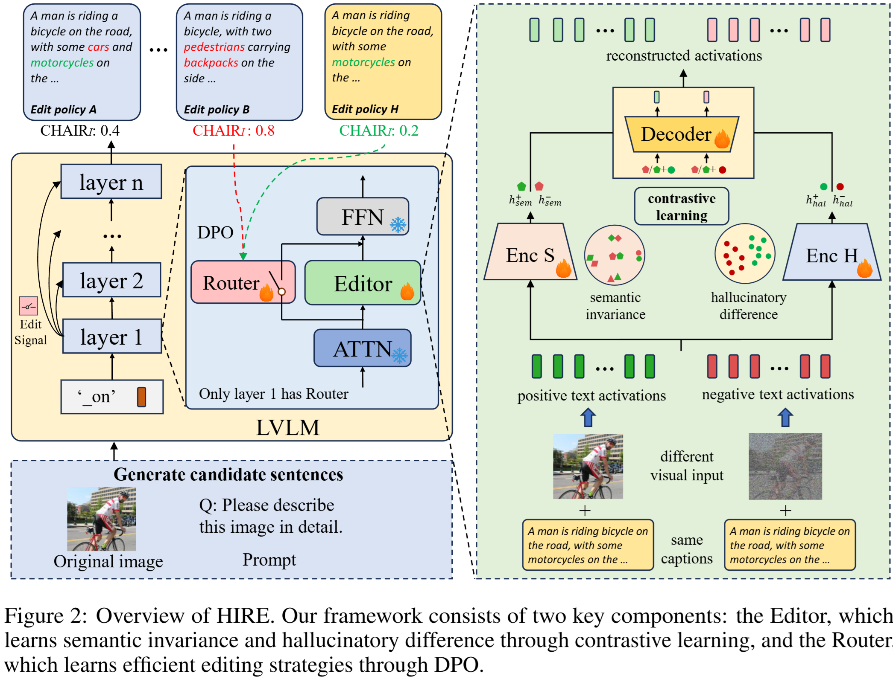

# Hallucination-aware Intermediate Representation Edit in Large Vision-Language Models

This repository contains the official pytorch implementation of the ICLR2026 paper: "Hallucination-aware Intermediate Representation Edit in Large Vision-Language Models".

## Method: HIRE
<p align="center">
  
</p>

## Environment Setup
```bash
conda create HIRE python=3.10
conda activate HIRE
git clone https://github.com/ASGO-MM/HIRE
cd HIRE
pip install -r requirements.txt
```

## Dataset
- To train the editor, please download and extract the images and annotations from [this link](https://github.com/facebookresearch/DCI?tab=readme-ov-file).
- To train the router, please download and extract the MSCOCO 2014 dataset from [this link](https://cocodataset.org/).

## Models
*About model Pre-trained checkpoints*
- [**LLaVA-1.5**](https://github.com/haotian-liu/LLaVA): Download [LLaVA-1.5 merged 7B](https://huggingface.co/liuhaotian/llava-v1.5-7b)

## Training
First, extract the positive and negative hidden_states.
```bash
bash train_hire/scripts/extract_hidden_states.sh
```
Need to specify "model_path", "data_path","hidden_states_path"

Then, train the editor.
```bash
bash train_hire/scripts/train_hire_editor.sh
```
Need to specify "model_path", "data_path","hidden_states_path"

Finally, train the router.
```bash
bash train_hire/scripts/train_hire_router.sh
```
Need to specify "hidden_states_path", "checkpoint_path","direction_save_path"

## Inference
```bash
bash train_hire/scripts/generate_caption.sh
```
Need to specify "editor-model-path", "model-path", "image-folder", "anno-folder", chair-path"


## Acknowlegdements
This codebase is based on [LLaVA](https://github.com/haotian-liu/LLaVA), [TruthX](https://github.com/ictnlp/TruthX), [CHAIR](https://github.com/Maxlinn/CHAIR-metric-standalone). Many thanks to the authors for generously sharing their codes!